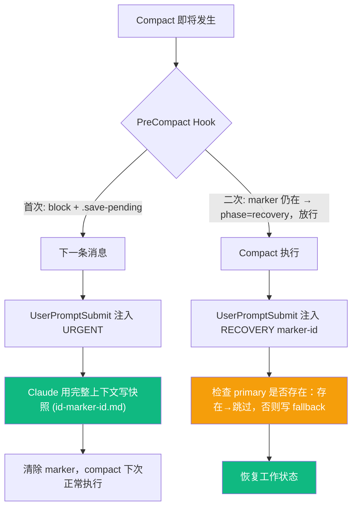

<p align="center">
  <h1 align="center">Plume-Skills</h1>
  <p align="center">
    <strong>Give your Claude Code a brain that survives compact, a workflow that ships, and a diary that writes itself.</strong>
  </p>
  <p align="center">
    Built on <a href="https://github.com/obra/superpowers">superpowers</a> &nbsp;|&nbsp; Context persistence &nbsp;|&nbsp; Auto daily reports
  </p>
</p>

---

> plume-skills 基于 [obra/superpowers](https://github.com/obra/superpowers) 的 12 个开发工作流 skills，通过 wrapper 模式进行定制扩展

> 并新增上下文管理和日报生成能力，整合为一个统一框架。Symlink 部署，零侵入、零依赖、幂等安装


**核心特点**：

- **Wrapper 定制** — 不修改 vendor 原文，通过 `<PLUME-OVERRIDE>` 按需覆盖输出路径、流程门控、locale 等
- **Context Keeper** — 自研。双保险 compact 保护，基于 Claude 原生数据的全会话历史索引
- **Digest** — 自研。从 Claude 原生会话数据生成跨项目日报，研究报告自然语言触发，scope 隔离隐私

## 快速开始

```bash
git clone <your-repo> ~/plume-skills && cd ~/plume-skills

# 通用 skills（引导、上下文管理、日报/研发记录 等非开发对话也通用的 skills）
./install.sh --universal

# 为项目安装工作流 skills（具体项目目录下才安装 superpowers skills 套件及其对应的 warpper 定制）
./install.sh --project ~/my-project
```

启动 Claude Code 即可使用。框架通过 SessionStart hook 自动注入，Claude 按需加载 skills。

## 目录结构

```
plume-skills/
├── skills/                           # 自研 3 + wrapper 13 + 社区 2
│   ├── using-plume/                  #   框架引导（hook 自动注入）
│   ├── context-keeper/               #   上下文保存与恢复
│   ├── digest/                       #   日报与研究报告
│   ├── brainstorming-universal/      #   通用 brainstorming（显式激活）
│   ├── brainstorming/                #   项目 brainstorming（严格自动触发）
│   ├── writing-plans/                #   实施计划（定制：输出路径 + locale）
│   ├── executing-plans/              #   执行计划（定制：读取路径）
│   ├── finishing-a-development-branch/ # 分支收尾（定制：Git 方案展示）
│   └── ...                           #   其余 8 个工作流 wrapper
│
├── vendor/                           # 社区 skills 原文（git 追踪，不直接部署）
│   ├── superpowers/                  #   obra/superpowers
│   ├── find-skills/                  #   vercel-labs/skills
│   └── skill-creator/                #   anthropics/skills
│
├── hooks/                            # PreCompact / UserPromptSubmit
├── templates/                        # wrapper / 报告 / git-plan 模板
├── config.yml                        # 全局配置（locale、scope）
├── install.sh                        # 部署器（幂等，支持 --update 一键同步）
└── data/                             # 运行时数据（gitignored）
    ├── journal/                      #   日报（跨项目）
    ├── digest-hint/                  #   日报触发 marker（每日去重）
    └── reports/                      #   研究报告
```

**上下文数据**存储在 Claude 项目目录 `~/.claude/projects/<slug>/plume-context/`，不在 plume-skills 内。

**项目产出**（specs、plans）存储在各项目的 `docs/plume-skills/` 下。

## Context Keeper

> Claude Code 长会话触发 compact 时丢失工作状态。context-keeper 用双保险机制解决这个问题，基于 Claude 原生 jsonl 会话记录，只维护索引层（session snapshots + CONTEXT-INDEX.md）。

### 双保险 Compact 保护



- **`<id>-<marker-id>.md`**（手动保存或 PreCompact 拦截）：完整上下文，最高质量
- **`<id>-<marker-id>-fallback.md`**（compact 已执行）：compact 摘要，质量次之但完全可靠
- 恢复时同一 marker-id 下优先读 primary（无 fallback 后缀）；多个 marker-id 时读最新

### 清理

当快照 + jsonl 数据量超过配置阈值（默认 500MB）时，`context-keeper cleanup` 按"最久未更新"和"最大体积"推荐清理候选，支持一键删除或选择性删除。永远不删 MEMORY.md。

### 存储

```
~/.claude/projects/<slug>/plume-context/
├── CONTEXT-INDEX.md                      # 全历史时间线索引（≤1500 tokens）
└── sessions/
    ├── <id>-<YYYYMMDD-HHMM>.md           # Primary 快照（PreCompact 拦截或手动保存）
    └── <id>-<YYYYMMDD-HHMM>-fallback.md  # Fallback（compact 后恢复写入）
```

## Digest

> 从 Claude 原生数据（jsonl + session snapshots + MEMORY.md）生成日报和研究报告。

### 日报

```bash
/digest daily                         # 今日日报（default_scope）
/digest daily 2026-03-15              # 指定日期
/digest daily --scope edge-exploration # 指定作用域
```

- **一天一份，跨项目聚合** — scope 下所有项目当天活跃会话
- **数据源优先级** — session snapshots > CONTEXT-INDEX.md > jsonl 尾部
- **Scope 隔离** — Claude 原生目录名子串匹配，公司与个人项目天然分离
- **输出** — `data/journal/YYYY-MM-DD.md`

### 研究报告

```bash
/digest report 用户认证相关的工作      # 自然语言，语义匹配
/digest report                         # 展示话题聚类供选择
```

- **自然语言触发** — 从 CONTEXT-INDEX.md 和 session snapshots 语义匹配
- **已有报告更新** — 文件存在时确认：智能合并 / 覆盖 / 另存 / 取消
- **输出** — `data/reports/<topic>.md`

## 安装与部署

| 命令 | 作用 |
|------|------|
| `./install.sh --universal` | 6 个通用 skills + hooks + 权限模板 → `~/.claude/` |
| `./install.sh --project <path>` | 12 个工作流 skills + 权限 → `<project>/.claude/` |
| `./install.sh --update` | 一键同步：补齐新 skills、更新 hooks、增量合并权限 |
| `./install.sh --update --clean-permissions` | 同上 + 清理非模板权限条目 |
| `./install.sh --repair` | 搬迁目录后修复 symlinks、hook 路径、config |
| `./install.sh --dry-run` | 预览不执行 |

所有部署**幂等** — 重复执行无副作用。更新 skills 内容后执行 `--update` 即可一键同步。

## Wrapper 模式

所有工作流 skills 通过 wrapper 间接引用 vendor 原文。定制只需编辑 `<PLUME-OVERRIDE>` 块：

```markdown
<PLUME-OVERRIDE>
- Output path: <project-root>/docs/plume-skills/specs/
- Gate: wait for user approval after spec review
</PLUME-OVERRIDE>

→ Read PLUME_ROOT/vendor/superpowers/brainstorming/SKILL.md
→ Override wins where conflicts exist; vendor as-is elsewhere
```

新建 wrapper 参考 `templates/wrapper-skill.md`。

## 配置

```yaml
# config.yml
plume_root: /home/plume/plume-skills      # install.sh 自动设置

locale:
  timezone: "Asia/Shanghai"               # 时间戳、日报日期
  language: "zh-CN"                       # 生成文档语言

context:
  max_data_size_mb: 500                   # 快照数据量上限，超过时提醒清理

digest:
  default_scope: "edge-exploration"       # 日报默认作用域
  auto_generate: false                    # true = 到点自动生成
  remind_at: ["09:00", "18:00"]           # 提醒时间点
```

## 模板

| 文件 | 用途 |
|------|------|
| `templates/wrapper-skill.md` | Wrapper 骨架 + 编写指南 |
| `templates/session-snapshot.md` | Context Keeper 快照格式 |
| `templates/context-index.md` | Context Keeper 索引格式 |
| `templates/cleanup-report.md` | 快照清理报告格式 |
| `templates/daily-report.md` | 日报结构 |
| `templates/research-report.md` | 研究报告结构 |
| `templates/git-plan.md` | Git 操作方案（提交前展示） |

## 致谢

工作流 skills 构建在优秀的社区开源工作之上：

- **[superpowers](https://github.com/obra/superpowers)** by Jesse Vincent — 从头脑风暴到代码审查的完整开发工作流 skills 体系。12 个工作流 skills 均源自此项目，部分通过 wrapper 定制。
- **[skills](https://github.com/vercel-labs/skills)** by Vercel — find-skills，发现和安装社区 skills。
- **[skills](https://github.com/anthropics/skills)** by Anthropic — skill-creator，从零创建自定义 skills。

上下文管理设计参考：
- **[context-mode](https://github.com/mksglu/context-mode)** — 累积事件 + 优先级分层
- **[memsearch](https://github.com/zilliztech/memsearch)** — Markdown append-only 记忆管理

## 许可证

[Apache License 2.0](LICENSE)

| vendor 来源 | 原始许可证 |
|-------------|-----------|
| [obra/superpowers](https://github.com/obra/superpowers) | MIT |
| [vercel-labs/skills](https://github.com/vercel-labs/skills) | MIT |
| [anthropics/skills](https://github.com/anthropics/skills) | Apache 2.0 |

vendor/ 中的内容已精简，仅保留本项目所需部分。完整内容请访问源仓库。
