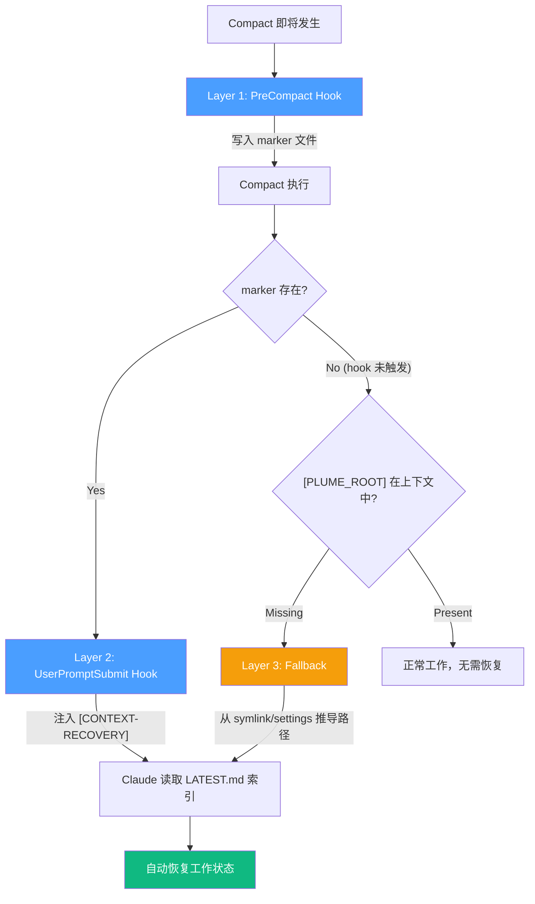

<p align="center">
  <h1 align="center">Plume-Skills</h1>
  <p align="center">
    <strong>Give your Claude Code a brain that survives compact, a workflow that ships, and a diary that writes itself.</strong>
  </p>
  <p align="center">
    Built on <a href="https://github.com/obra/superpowers">superpowers</a> &nbsp;|&nbsp; Context persistence &nbsp;|&nbsp; Auto daily reports
  </p>
</p>

---

> plume-skills 基于 [obra/superpowers](https://github.com/obra/superpowers) 的 12 个开发工作流 skills，通过 wrapper 模式进行定制扩展

> 并新增上下文管理和日报生成能力，整合为一个统一框架。Symlink 部署，零侵入、零依赖、幂等安装


**核心特点**：

- **Wrapper 定制** — 不修改 vendor 原文，通过 `<PLUME-OVERRIDE>` 按需覆盖输出路径、流程门控、locale 等
- **Context Keeper** — 自研。三层 compact 保护，自动恢复工作状态，不丢一个决策
- **Digest** — 自研。基于 Claude 对话内容的跨项目日报一键生成，研究报告自然语言触发，scope 隔离非指定项目的对话隐私

## 快速开始

```bash
git clone <your-repo> ~/plume-skills && cd ~/plume-skills

# 通用 skills（引导、上下文管理、日报/研发记录 等非开发对话也通用的 skills）
./install.sh --universal

# 为项目安装工作流 skills（具体项目目录下才安装 superpowers skills 套件及其对应的 warpper 定制）
./install.sh --project ~/my-project
```

启动 Claude Code 即可使用。框架通过 SessionStart hook 自动注入，Claude 按需加载 skills。

## 目录结构

```
plume-skills/
├── skills/                           # 自研 3 + wrapper 13 + 社区 2
│   ├── using-plume/                  #   框架引导（hook 自动注入）
│   ├── context-keeper/               #   上下文保存与恢复
│   ├── digest/                       #   日报与研究报告
│   ├── brainstorming-universal/      #   通用 brainstorming（显式激活）
│   ├── brainstorming/                #   项目 brainstorming（严格自动触发）
│   ├── writing-plans/                #   实施计划（定制：输出路径 + locale）
│   ├── executing-plans/              #   执行计划（定制：读取路径）
│   ├── finishing-a-development-branch/ # 分支收尾（定制：Git 方案展示）
│   └── ...                           #   其余 8 个工作流 wrapper
│
├── vendor/                           # 社区 skills 原文（git 追踪，不直接部署）
│   ├── superpowers/                  #   obra/superpowers
│   ├── find-skills/                  #   vercel-labs/skills
│   └── skill-creator/                #   anthropics/skills
│
├── hooks/                            # SessionStart / PreCompact / UserPromptSubmit
├── templates/                        # wrapper / 报告 / git-plan 模板
├── config.yml                        # 全局配置（locale、scope、tags 等）
├── install.sh                        # 部署器（幂等）
└── data/                             # 运行时数据（gitignored）
    ├── journal/                      #   日报（跨项目）
    ├── reports/                      #   研究报告
    └── <slug>/                       #   项目级工作数据
        ├── segments/                 #     上下文时间线
        ├── LATEST.md                 #     轻量索引（≤400 token）
        ├── tags-index.md             #     标签倒排索引
        ├── specs/                    #     设计文档
        └── plans/                    #     实施计划
```

## Skills 一览

### 通用 Skills &nbsp; `--universal` → `~/.claude/skills/`

| Skill | 类型 | 说明 |
|-------|:----:|------|
| **using-plume** | 自研 | 框架引导，SessionStart hook 自动注入 |
| **context-keeper** | 自研 | 保存/恢复会话上下文，三层 compact 保护 |
| **digest** | 自研 | 日报（`/digest daily`）+ 研究报告（`/digest report`） |
| **brainstorming** | wrapper | 结构化设计探索，显式请求触发 |
| **find-skills** | 社区 | 发现和安装社区 skills |
| **skill-creator** | 社区 | 从零创建自定义 skills |

### 项目 Skills &nbsp; `--project` → `<project>/.claude/skills/`

| Skill | 说明 |
|-------|------|
| **brainstorming** | 严格自动触发（遮盖通用版） |
| **writing-plans** | 设计 → 可执行实施计划 |
| **executing-plans** | 按计划逐步执行 |
| **subagent-driven-development** | 多任务子代理协调 |
| **dispatching-parallel-agents** | 并行任务调度 |
| **test-driven-development** | TDD 红绿重构循环 |
| **systematic-debugging** | 根因分析优先的系统化调试 |
| **requesting-code-review** | 请求代码审查 |
| **receiving-code-review** | 响应审查意见 |
| **verification-before-completion** | 完成前的证据验证 |
| **finishing-a-development-branch** | 分支收尾 + Git 操作方案展示 |
| **using-git-worktrees** | Git worktree 隔离开发 |

## Context Keeper

> Claude Code 长会话触发 compact 时丢失工作状态。context-keeper 用三层保护解决这个问题。

### 三层保护



### 保存策略

不在每个阶段自动保存（避免浪费 token），三种触发方式：

1. **用户请求** — 「保存上下文」/ "save context"
2. **消息计数** — 累计 ≥15 轮后 hook 注入 `[CONTEXT-SAVE-RECOMMENDED]`（阈值可配置）
3. **PreCompact 拦截** — compact 首次触发时 hook 阻断并写入 `.save-pending`，下一条用户消息注入 `[CONTEXT-SAVE-URGENT]`，Claude 完成保存后才放行 compact

### Segment 结构

每次保存生成 `data/<slug>/segments/YYYY-MM-DDTHH-MM.md`：

| 字段 | 内容 |
|------|------|
| Summary | 本阶段完成了什么 |
| Artifacts | 创建/修改的文件（含 specs、plans） |
| Decisions | 关键决策及理由 |
| Tags | `category:value` 格式，供 digest 检索 |

**LATEST.md** 是轻量索引（≤400 token）：当前任务、下一步、segment 索引表。恢复时只读索引，按需加载细节。

**Tags 约束**：`config.yml` 中可配置词表（`tech` / `module` / `activity` / `ref`），确保跨 segment 检索一致性。

## Digest

> 消费 context-keeper 的 segments，聚合为日报或研究报告。

### 日报

```bash
/digest daily                         # 今日日报（default_scope）
/digest daily 2026-03-15              # 指定日期
/digest daily --scope edgeexploration # 指定作用域
```

- **一天一份，跨项目聚合** — scope 下所有项目当天工作
- **Scope 隔离** — slug 子串匹配，公司项目与个人项目天然分离
- **自动生成** — `auto_generate: true` + `remind_at` 时间窗口内 + ≥3 segments → 自动执行
- **输出** — `data/journal/YYYY-MM-DD.md`

### 研究报告

```bash
/digest report 用户认证相关的工作      # 自然语言，语义匹配 tags
/digest report auth                    # tag 关键词
/digest report                         # 展示 tag 聚类供选择
/digest report auth --since 2026-03-01 # 限定时间
```

- **自然语言触发** — 不需要精确 tag 名称
- **已有报告更新** — 文件存在时向用户确认：智能合并 / 覆盖 / 另存 / 取消
- **输出** — `data/reports/<topic>.md`

### 其他

```bash
/digest status          # segments 总览、项目分布、top tags
/digest rebuild-index   # 重建所有 tags-index.md
```

## 安装与部署

| 命令 | 作用 |
|------|------|
| `./install.sh --universal` | 6 个通用 skills + 3 个 hooks + 权限模板 → `~/.claude/` |
| `./install.sh --project <path>` | 12 个工作流 skills + 权限 → `<project>/.claude/` |
| `./install.sh --repair` | 搬迁目录后修复 symlinks、hook 路径、config |
| `./install.sh archive <keyword>` | 归档匹配的项目数据 |
| `./install.sh archive --all` | 归档全部数据 |
| `./install.sh --dry-run` | 预览不执行（搭配 --universal 或 --project） |

所有部署**幂等** — 重复执行无副作用。

## Wrapper 模式

所有工作流 skills 通过 wrapper 间接引用 vendor 原文。定制只需编辑 `<PLUME-OVERRIDE>` 块：

```markdown
<PLUME-OVERRIDE>
- Output path: $PLUME_ROOT/data/<slug>/specs/
- Gate: wait for user approval after spec review
</PLUME-OVERRIDE>

→ Read PLUME_ROOT/vendor/superpowers/brainstorming/SKILL.md
→ Override wins where conflicts exist; vendor as-is elsewhere
```

无定制需求时 override 块为空，日后直接替换。新建 wrapper 参考 `templates/wrapper-skill.md`。

## 配置

```yaml
# config.yml
plume_root: /home/plume/plume-skills      # install.sh 自动设置

locale:
  timezone: "Asia/Shanghai"               # 时间戳、日报日期
  language: "zh-CN"                       # 生成文档语言

context:
  save_remind_after: 15                   # N 轮消息后提醒保存

digest:
  default_scope: "edgeexploration"        # 日报默认作用域
  auto_generate: false                    # true = 到点自动生成
  remind_at: ["09:00", "18:00"]           # 提醒时间点

tags:                                     # segment tag 约束词表
  tech: [react, typescript, go, ...]
  module: [auth, payment, user, ...]
  activity: [feature, bugfix, refactor, ...]
  ref: []                                 # issue/PR 编号
```

## 模板

| 文件 | 用途 |
|------|------|
| `templates/wrapper-skill.md` | Wrapper 骨架 + 编写指南 |
| `templates/daily-report.md` | 日报结构 |
| `templates/research-report.md` | 研究报告结构 |
| `templates/git-plan.md` | Git 操作方案（提交前展示） |
| `templates/settings.local.append.json` | 权限合并模板 |

## 致谢

工作流 skills 构建在优秀的社区开源工作之上：

- **[superpowers](https://github.com/obra/superpowers)** by Jesse Vincent — 从头脑风暴到代码审查的完整开发工作流 skills 体系。12 个工作流 skills 均源自此项目，部分通过 wrapper 定制。
- **[skills](https://github.com/vercel-labs/skills)** by Vercel — find-skills，发现和安装社区 skills。
- **[skills](https://github.com/anthropics/skills)** by Anthropic — skill-creator，从零创建自定义 skills。

上下文管理设计参考：
- **[context-mode](https://github.com/mksglu/context-mode)** — 累积事件 + 优先级分层
- **[memsearch](https://github.com/zilliztech/memsearch)** — Markdown append-only 记忆管理

## 许可证

[Apache License 2.0](LICENSE)

| vendor 来源 | 原始许可证 |
|-------------|-----------|
| [obra/superpowers](https://github.com/obra/superpowers) | MIT |
| [vercel-labs/skills](https://github.com/vercel-labs/skills) | MIT |
| [anthropics/skills](https://github.com/anthropics/skills) | Apache 2.0 |

vendor/ 中的内容已精简，仅保留本项目所需部分。完整内容请访问源仓库。
